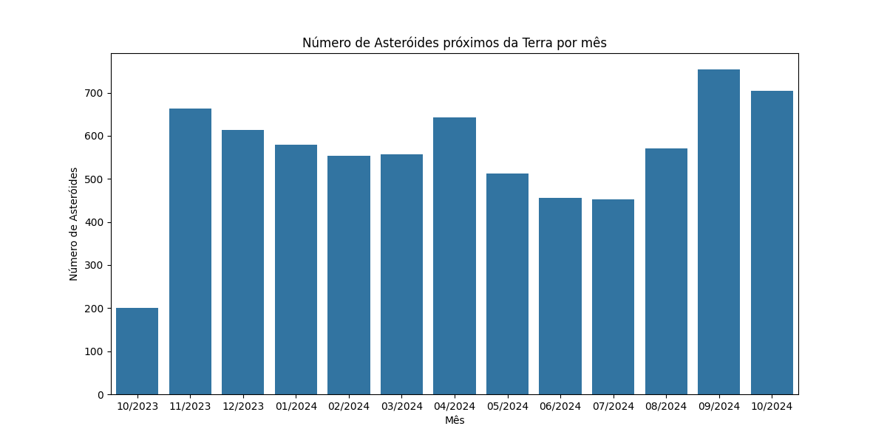
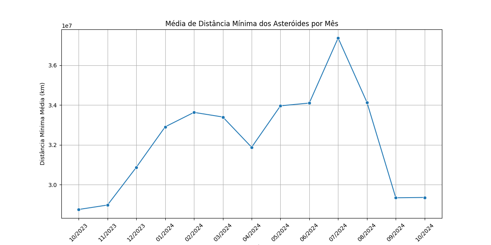
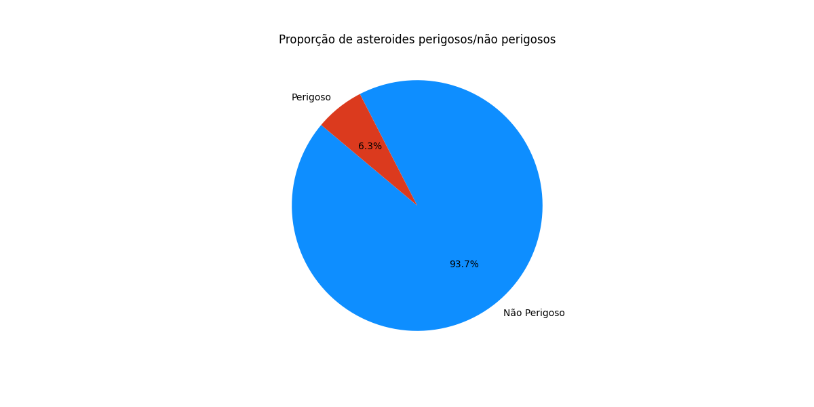
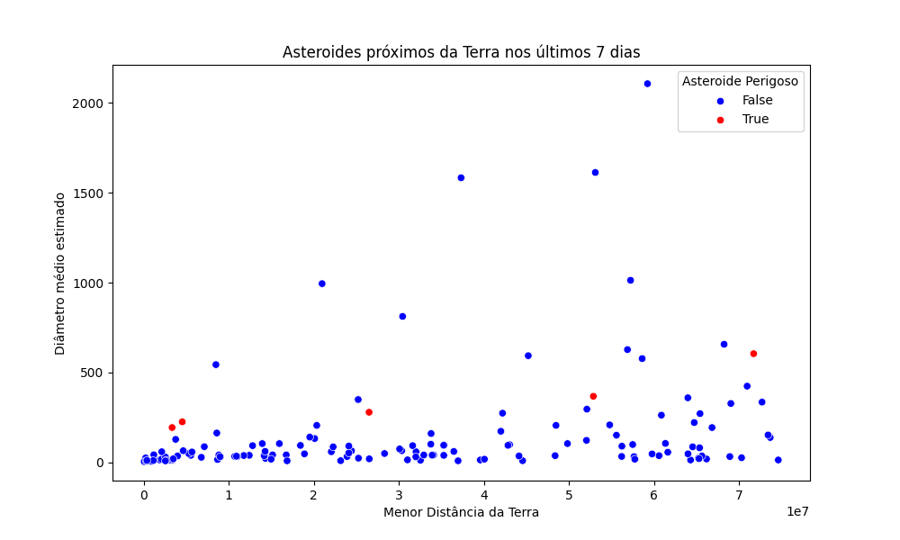
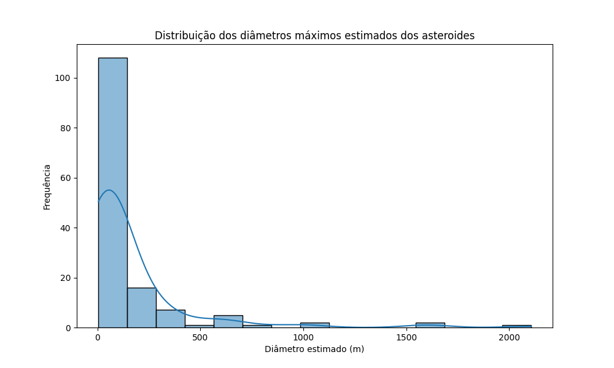
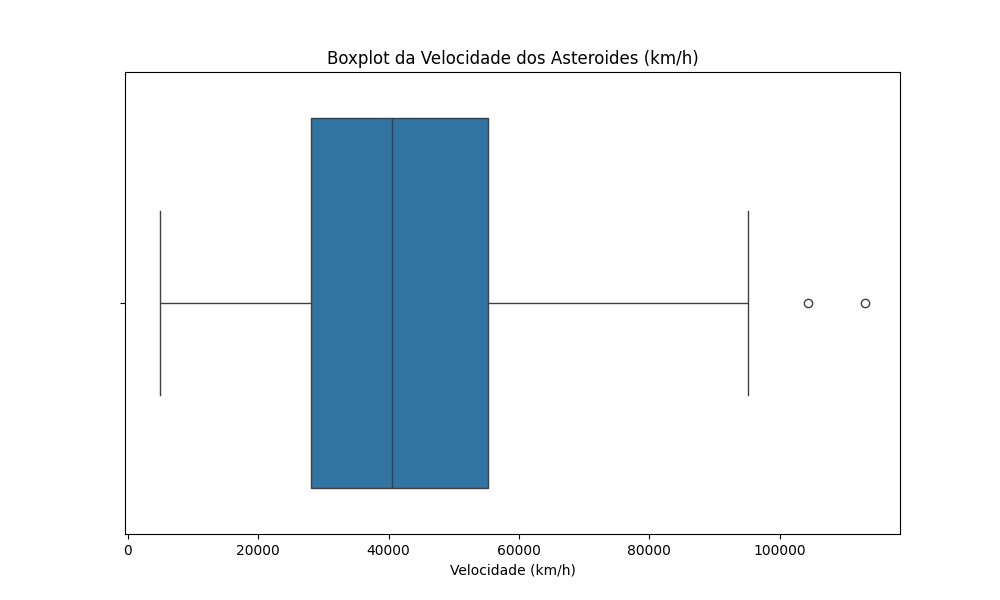

# Análise de Dados de Asteróides Próximos à Terra (API Nasa)

Este trabalho visa analisar os dados de asteroides que estiveram próximos à Terra no último ano com gráficos que abordam diferentes partes dos dados, tentando identificar padrões e insights relevantes.

## Primeira Análise - Número de Asteróides que passaram próximo da Terra

**Análise:** Esse gráfico é importante para ver os períodos que tiveram maior índices de asteroides próximos à Terra, já que podem haver alguns padrões. Talvez seria interessante comparar com alguns anos passados.

### Resposta da IA Generativa:
Os dados fornecidos mostram uma variação no número de asteroides próximos da Terra ao longo de um período de um ano, de outubro de 2023 a outubro de 2024. Algumas observações e possíveis interpretações incluem:

1. **Flutuações Mensais:** O número de asteroides próximos parece flutuar de mês para mês, sem um padrão aparente de crescimento ou redução contínua. Isso poderia indicar variações naturais na trajetória e detecção dos asteroides, possivelmente influenciadas por fatores como a posição da Terra em sua órbita ou eventos astronômicos específicos.

2. **Pico e Queda:** Nota-se um aumento significativo no número de asteroides em setembro de 2024 (754) e outubro de 2024 (705) em comparação com os meses anteriores, o que pode sugerir um incremento na atividade ou na capacidade de detecção durante esses meses. Fatores sazonais ou melhorias nos métodos de monitoramento podem ser responsáveis por isso.

3. **Possíveis Melhorias na Detecção:** O aumento inicial observado entre outubro de 2023 (200) e novembro de 2023 (664) pode refletir uma melhoria na tecnologia de detecção ou um esforço intensificado para monitorar asteroides próximos à Terra, ao invés de uma mudança repentina na atividade dos asteroides.

4. **Importância do Monitoramento Contínuo:** Esses dados destacam a importância do monitoramento contínuo dos asteroides próximos à Terra para entender melhor seus padrões de movimento e potencial risco. Variações mensais demonstram que a atividade pode ser imprevisível e sujeita a mudanças rápidas.

5. **Padrões de Curto Prazo:** Embora os dados sejam limitados a apenas um ano, eles não mostram um padrão claro de longo prazo. Isso ressalta a necessidade de análise contínua e de longo prazo para identificar possíveis tendências ou ciclos mais amplos na atividade de asteroides próximos à Terra.

Em resumo, enquanto não há uma tendência clara ou explicação definitiva para as variações mensais observadas, esses dados ressaltam a importância de continuar o monitoramento e a pesquisa para melhorar a compreensão dos padrões e comportamentos dos asteroides próximos à Terra.

---

## Segunda Análise - Média de distância mínima da Terra por mês

**Minha Análise:** Importante para poder visualizar possíveis momentos do ano que tivemos uma menor distância média dos asteroides da Terra.

### Resposta da IA Generativa:
A análise dos dados fornecidos sobre a distância mínima nos últimos 12 meses revela algumas tendências e padrões interessantes. Vamos examinar os principais pontos:

1. **Tendência Geral:** Observa-se um aumento geral na distância mínima ao longo do período de 12 meses. Em outubro de 2023, a distância registrada foi de aproximadamente 28,76 milhões de km, enquanto em setembro de 2024, essa distância havia aumentado para aproximadamente 29,34 milhões de km.

2. **Picos e Variações:** Há flutuações significativas nos dados. Por exemplo, o maior pico de distância mínima ocorre em julho de 2024, com aproximadamente 37,36 milhões de km, o que representa um aumento notável em relação aos meses anteriores.

3. **Queda Abrupta:** Após atingir esse pico em julho de 2024, observamos uma queda considerável na distância mínima em agosto de 2024 para cerca de 34,13 milhões de km, e continua a diminuir até setembro de 2024.

4. **Média do Período:** Para calcular a média de distância mínima ao longo dos 12 meses, somamos todas as distâncias e dividimos pelo número de entradas (13 no total). Realizando esse cálculo, obtemos uma média aproximada de 32,58 milhões de km.

5. **Conclusão:** A tendência desse conjunto de dados sugere uma variação significativa com picos ocasionais de distância mínima. Essa variação pode ser influenciada por múltiplos fatores astrofísicos e orbitais que afetam a proximidade momentânea. Contudo, a média geral mais elevada ao longo do período sugere que, apesar das variações, o objeto em questão tendia, em média, a estar mais distante nos últimos meses analisados, comparativamente ao início do período.

---

## Terceira Análise - Proporção de asteroides perigosos/não perigosos à Terra

**Importante para ver a proporção de asteroides que trazem algum perigo à Terra, para as entidades possam tomar algum tipo de prevenção contra os perigosos.**

### Resposta da IA Generativa:
Os dados apresentados indicam a quantidade de asteroides classificados como "perigosos" e "não perigosos". Do total, 6800 asteroides foram considerados não perigosos, enquanto 460 foram classificados como perigosos. Para entender melhor esses números, podemos calcular a proporção de cada categoria em relação ao total de asteroides.

O total de asteroides é 6800 + 460 = 7260.

- Proporção de asteroides não perigosos: \( \frac{6800}{7260} \approx 0.936 \) ou 93.6%.
- Proporção de asteroides perigosos: \( \frac{460}{7260} \approx 0.063 \) ou 6.3%.

Esses números sugerem que a grande maioria dos asteroides observados, cerca de 93.6%, não apresentam perigo significativo, enquanto uma menor, mas ainda relevante, fração de 6.3% é considerada perigosa. Esses dados são importantes para direcionar os esforços de monitoramento e mitigação de riscos astronômicos, ajudando a priorizar quais asteroides devem ser acompanhados mais de perto e quais estratégias podem ser desenvolvidas para lidar com potenciais ameaças à Terra.

---

## Quarta Análise - Visualizando correlação entre Menor distância e diâmetro máximo estimado

**Análise**: Importante para visualizar qual é o diâmetro dos asteroides que passam mais perto da Terra
Assim, temos uma noção de quanto estrago o asteroide poderia gerar se chegasse até a Terra
- Nesse caso há um certo padrão nessa distribuição, os asteroides estão mais agrupados no canto inferior esquerdo, denotando que os asteroides que chegam mais próximos à Terra geralmente são menores

### Resposta da IA Generativa:
Os dados fornecidos sugerem duas séries de medidas relacionadas aos asteroides: uma informa os diâmetros médios estimados (em, presumivelmente, metros) de diversos asteroides e a outra indica a distância mínima estimada (novamente, presumivelmente em metros ou alguma outra unidade padrão) de cada asteroide à Terra.

Aqui estão algumas observações e considerações sobre os dados:

1. **Diâmetro dos Asteroides:** Os diâmetros parecem variar bastante, desde valores muito pequenos até alguns em torno de 2100 metros (ou outra unidade). Isso indica uma diversidade significativa no tamanho dos asteroides próximos à Terra.

2. **Distância dos Asteroides à Terra:** As distâncias mínimas também variam consideravelmente, mas todos os valores são relativamente grandes, o que é uma boa notícia, pois indica que esses asteroides, por enquanto, não representam uma ameaça iminente de colisão com a Terra.

3. **Correlação Tamanho-Distância:** Poderia ser interessante analisar se há alguma correlação entre o tamanho de um asteroide e sua proximidade com a Terra, embora, tipicamente, a órbita de um asteroide e sua distância da Terra sejam mais dependentes de sua trajetória do que de seu tamanho.

4. **Riscos e Observações:** Asteroides grandes que passam a distâncias relativamente mais próximas continuam sendo objeto de intenso estudo devido ao seu potencial risco. Felizmente, a astronomia moderna permite monitoramento contínuo dessas rochas espaciais.

5. **Considerações para Futuras Missões Espaciais:** Informações sobre tamanho e proximidade são cruciais para o planejamento de possíveis missões de exploração de asteroides. Asteroides de tamanhos variados próximos à Terra podem ser candidatos para missões de estudo ou mineração, dependendo de sua composição e trajetória.

6. **Diferenças Excepcionais:** Qualquer anormalidade, como um diâmetro muito grande ou um asteroide passando a uma distância excepcionalmente curta, deve ser investigada mais a fundo pelos cientistas, potencialmente resultando em mais observações ou mesmo na necessidade de planos de mitigação futuros.

Em suma, esses dados são fundamentais para a segurança planetária e planejamento de futuras explorações espaciais. Eles destacam a importância de monitorar constantemente asteroides próximos à Terra e entender suas características e trajetórias.

---

## Quinta Análise - Visualizando a distribuição de diâmetro médio dos asteroides

**Importante para observarmos o tamanho dos asteroides que passam perto da Terra, pois assim podemos ter uma noção de estrago que poderiam causar.**

### Resposta da IA Generativa:
Para comentar sobre a média e distribuição das estimativas dos asteroides fornecidas, primeiro devemos calcular a média. Para os dados apresentados, o diâmetro médio dos asteroides varia de 0,75 metros a 2.100 metros, mostrando uma ampla gama de tamanhos.

Aqui estão algumas considerações:

1. **Distribuição dos Dados:** A distribuição dos diâmetros dos asteroides pode seguir um padrão específico. Se muitos asteroides são pequenos, isso pode afetar a média. No entanto, se existirem poucos asteroides muito grandes, eles podem distorcer a média para cima.

2. **Cálculo da Média:** A média pode ser calculada somando todos os valores de diâmetro e dividindo pelo número total de asteroides. A média é um indicador útil, mas pode não refletir a realidade se a distribuição for muito enviesada.

3. **Importância dos Tamanhos:** Asteroides com diâmetros maiores tendem a ser mais preocupantes em termos de impacto. Portanto, é crucial monitorar não apenas a quantidade de asteroides, mas também seu tamanho e distância em relação à Terra.

4. **Conclusão:** Essa análise sobre a distribuição dos tamanhos dos asteroides pode levar a importantes conclusões sobre a segurança e o potencial impacto desses corpos celestes. Os tamanhos variáveis nos ajudam a compreender os riscos que podem apresentar e a importância de um monitoramento contínuo.

---

## Sexta Análise - Vendo a Distribuição das Velocidades

**Visualizando a distribuição de velocidade dos asteroides**

### Resposta da IA Generativa:
O conjunto de velocidades dos asteroides que você forneceu varia bastante, indo desde valores tão baixos quanto 4.966,978 km/h até valores tão altos quanto 113.072,731 km/h. 

Algumas observações podem ser feitas com base nesses dados:

1. **Variedade de Velocidades:** A grande variação nas velocidades sugere que esses asteroides poderão ter diferentes tamanhos, composições ou trajetórias próximas a corpos celestes que podem influenciar suas velocidades.

2. **Velocidade Média:** Para determinar a velocidade média desses asteroides, seria necessário calcular a média aritmética de todas as velocidades listadas. Isso poderia dar uma ideia central sobre a mobilidade típica no espaço dessas rochas.

3. **Extremos Notáveis:** Dois valores se destacam, um na parte superior do espectro (113.072,731 km/h) e outro na parte inferior (4.966,978 km/h), sugerindo que há condições extremas que afetam o movimento de alguns asteroides em comparação com a maioria.

4. **Asteroides mais Rápidos:** Asteroides com velocidades extremamente altas podem estar em órbitas altamente elípticas ou serem influenciados por interações gravitacionais com planetas ou outros corpos celestes.

5. **Asteroides mais Lentos:** Os asteroides com velocidades muito baixas podem estar em órbitas estáveis e menos perturbadas, ou podem estar em pontos do espaço onde a influência gravitacional é mínima.

Essa análise apresenta um vislumbre do quão dinâmica a população de asteroides pode ser no espaço próximo à Terra ou em outras regiões do sistema solar. Esses fatores são importantes para a compreensão da mecânica celeste e para a avaliação de possíveis riscos ou oportunidades que tais objetos possam oferecer.

---

### Problemas Observados
A principal dificuldade encontrada foi com relação a API da Nasa, que permitia extrair apenas um período de 7 dias. Com isso foi necessário criar uma outra forma de extrair para conseguir os últimos 365 dias.
